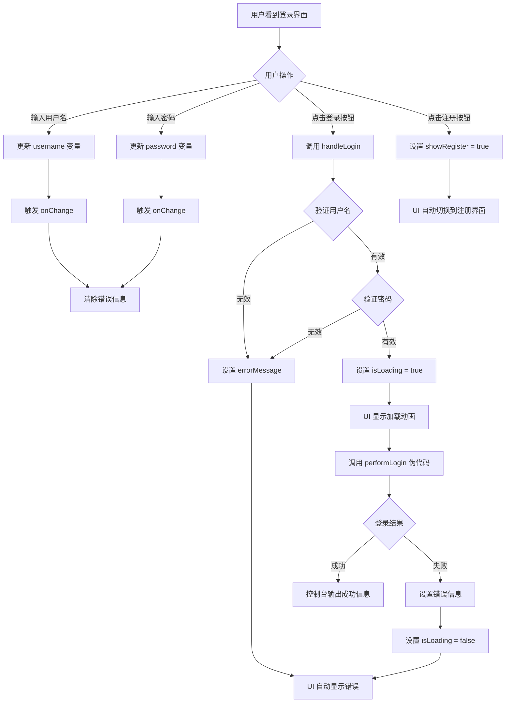
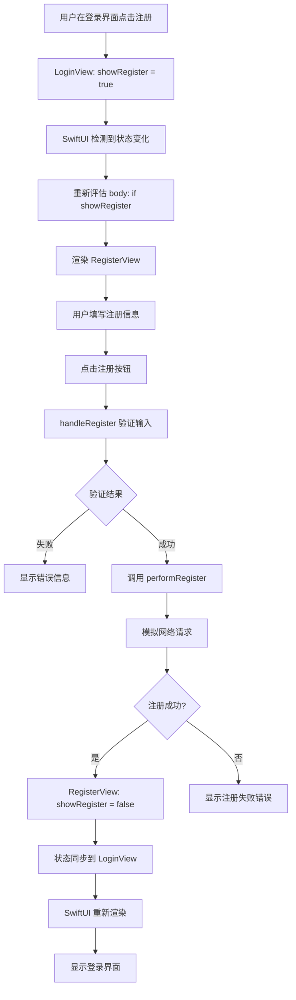
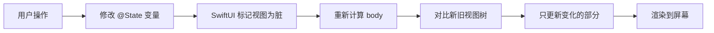
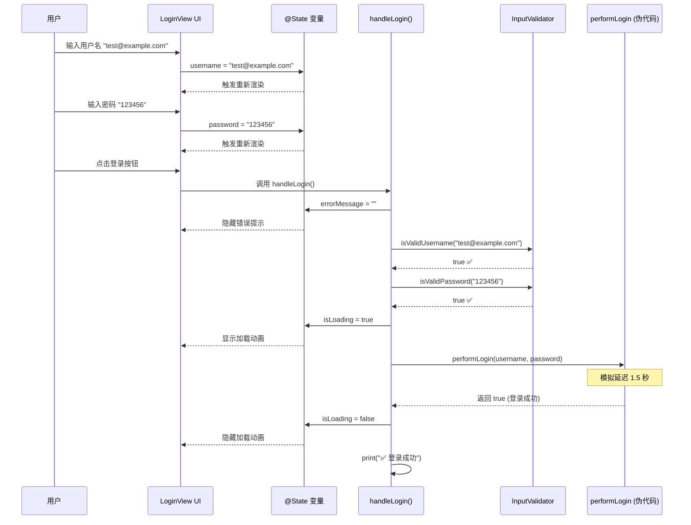

# 登录注册功能运行逻辑分析

> **文档目的**: 深入分析登录注册功能的运行流程、状态管理和数据流向  
> **适合读者**: 需要理解 SwiftUI 响应式编程和状态管理的开发者

---

## 🚀 应用启动流程

### 1. 应用入口 (`chat_storageApp.swift`)

```swift
@main
struct chat_storageApp: App {
    let persistenceController = PersistenceController.shared  // ① 创建数据库控制器
    
    var body: some Scene {
        WindowGroup {
            LoginView()  // ② 显示登录界面作为启动页
                .environment(\.managedObjectContext, 
                           persistenceController.container.viewContext)  // ③ 注入数据库上下文
        }
    }
}
```

**执行顺序**:
1. **应用启动** → macOS 调用标记了 `@main` 的结构体
2. **初始化数据库** → 创建 `PersistenceController.shared` 单例
3. **创建窗口组** → `WindowGroup` 创建主窗口
4. **渲染视图** → SwiftUI 渲染 `LoginView()`
5. **注入环境** → Core Data 上下文注入到视图树

---

## 🔐 登录界面运行逻辑

### 界面初始化

```swift
struct LoginView: View {
    // ① 状态变量初始化（视图创建时）
    @State private var username: String = ""
    @State private var password: String = ""
    @State private var errorMessage: String = ""
    @State private var showRegister: Bool = false
    @State private var isLoading: Bool = false
    
    var body: some View {
        // ② 根据 showRegister 状态决定显示哪个界面
        if showRegister {
            RegisterView(showRegister: $showRegister)  // 显示注册界面
        } else {
            loginContent  // 显示登录界面内容
        }
    }
}
```

**关键点**:
- **`@State` 修饰符**: 当这些变量的值改变时，SwiftUI 会自动重新渲染使用了这些变量的视图部分
- **条件渲染**: `if showRegister` 实现了两个界面的切换

---

### 用户交互流程图



---

### 登录按钮点击详细流程

#### 步骤 1: 用户点击登录按钮

```swift
Button(action: handleLogin) {
    // 按钮外观
}
```

#### 步骤 2: 执行 `handleLogin()` 方法

```swift
private func handleLogin() {
    // ① 清除之前的错误信息
    errorMessage = ""  // 触发 UI 更新，隐藏错误提示
    
    // ② 验证用户名格式
    guard InputValidator.isValidUsername(username) else {
        errorMessage = InputValidator.getUsernameErrorMessage(username)
        // errorMessage 变化 → SwiftUI 重新渲染 → 显示错误文本
        return  // 中断执行
    }
    
    // ③ 验证密码
    guard InputValidator.isValidPassword(password) else {
        errorMessage = InputValidator.getPasswordErrorMessage(password)
        return
    }
    
    // ④ 显示加载状态
    isLoading = true  // 触发 UI 更新，按钮显示 ProgressView
    
    // ⑤ 模拟异步网络请求
    DispatchQueue.main.asyncAfter(deadline: .now() + 1.5) {
        let success = performLogin(username: username, password: password)
        
        isLoading = false  // 触发 UI 更新，隐藏加载动画
        
        if success {
            print("✅ 登录成功！")
            // TODO: 实际项目中应该导航到主界面
        } else {
            errorMessage = "用户名或密码错误"  // 触发 UI 更新
        }
    }
}
```

---

### 输入验证逻辑 (`InputValidator`)

#### 验证流程

```mermaid
graph LR
    A[用户输入] --> B{InputValidator.isValidUsername}
    B --> C{包含 @}
    C -->|是| D[isValidEmail]
    D --> E{正则匹配}
    E -->|通过| F[✅ 有效邮箱]
    E -->|失败| G[❌ 邮箱格式错误]
    
    C -->|否| H[isValidPhone]
    H --> I{正则: ^1[3-9]\\d9$}
    I -->|通过| J[✅ 有效手机号]
    I -->|失败| K[❌ 手机号格式错误]
```

#### 核心验证代码

```swift
// 手机号验证
static func isValidPhone(_ phone: String) -> Bool {
    let phonePattern = "^1[3-9]\\d{9}$"
    // ① 创建谓词对象
    let phonePredicate = NSPredicate(format: "SELF MATCHES %@", phonePattern)
    // ② 使用正则表达式匹配
    return phonePredicate.evaluate(with: phone)
}

// 用户名验证（手机号或邮箱）
static func isValidUsername(_ username: String) -> Bool {
    return isValidPhone(username) || isValidEmail(username)
    // 只要满足其中一个条件即可
}
```

---

## 📝 注册界面运行逻辑

### 父子视图通信机制

```swift
// 父视图 LoginView
@State private var showRegister: Bool = false

// 传递给子视图
RegisterView(showRegister: $showRegister)
            // ↑ $ 符号创建 Binding（绑定）
```

```swift
// 子视图 RegisterView
@Binding var showRegister: Bool  // 接收来自父视图的绑定

// 在子视图中修改
showRegister = false  // 直接修改会同步到父视图
```

**关键概念**:
- **`@State`**: 视图自己拥有的状态
- **`@Binding`**: 对父视图状态的引用，可以双向同步
- **`$` 符号**: 创建 Binding 的语法糖

---

### 注册流程图



---

### 密码一致性检查逻辑

```swift
// 验证两次密码是否一致
guard password == confirmPassword else {
    errorMessage = "两次输入的密码不一致"
    return  // 中断注册流程
}
```

**执行时机**: 在点击注册按钮后，验证用户名和密码格式之后

---

## 🔄 状态管理详解

### SwiftUI 响应式更新机制



### 示例：错误信息显示

```swift
// 在 LoginView 中
@State private var errorMessage: String = ""

// UI 部分
if !errorMessage.isEmpty {
    Text(errorMessage)
        .foregroundColor(.red)
}

// 当设置错误信息时
errorMessage = "请输入密码"
// ↓ SwiftUI 自动执行以下步骤：
// 1. 检测到 errorMessage 变化
// 2. 重新评估 if !errorMessage.isEmpty → 变为 true
// 3. 渲染 Text 视图
// 4. 更新屏幕显示
```

---

## 📊 数据流向图

### 完整的登录流程数据流



---

## 🔧 关键技术点解析

### 1. `SecureField` 的工作原理

```swift
SecureField("请输入密码", text: $password)
```

- **绑定**: `$password` 将输入框与 `password` 变量双向绑定
- **安全性**: 用户输入时自动显示为圆点 ●
- **数据存储**: 实际值以明文存储在 `password` 变量中（仅显示时隐藏）

**注意**: `SecureField` 只负责显示时的隐藏，真正的安全需要在网络传输和存储时加密。

---

### 2. `onChange` 修饰符

```swift
TextField("手机号或邮箱", text: $username)
    .onChange(of: username) { _ in
        if !errorMessage.isEmpty {
            errorMessage = ""
        }
    }
```

**执行时机**: 每次 `username` 变量的值改变时

**用途**: 实现"用户重新输入时清除错误信息"的交互逻辑

---

### 3. `guard` 语句的提前退出机制

```swift
guard InputValidator.isValidUsername(username) else {
    errorMessage = InputValidator.getUsernameErrorMessage(username)
    return  // 提前退出函数
}
// 只有验证通过才会执行到这里
```

**优势**: 
- 代码可读性强（正向逻辑）
- 避免深层嵌套的 if-else

---

### 4. 异步延迟模拟网络请求

```swift
DispatchQueue.main.asyncAfter(deadline: .now() + 1.5) {
    // 1.5 秒后执行这里的代码
    let success = performLogin(username: username, password: password)
    // ...
}
```

**用途**: 模拟真实的网络请求延迟

**注意**: `DispatchQueue.main` 确保回调在主线程执行（UI 更新必须在主线程）

---

## 🎯 伪代码与真实代码的对比

### 当前实现（伪代码）

```swift
private func performLogin(username: String, password: String) -> Bool {
    // 硬编码的测试账号验证
    return (username == "13800138000" || username == "test@example.com") 
           && password == "123456"
}
```

### 真实实现（网络请求）

```swift
private func performLogin(username: String, password: String) async throws -> Bool {
    // 1. 构建 API 请求
    let url = URL(string: "https://api.example.com/login")!
    var request = URLRequest(url: url)
    request.httpMethod = "POST"
    request.setValue("application/json", forHTTPHeaderField: "Content-Type")
    
    // 2. 构建请求体
    let body = ["username": username, "password": password]
    request.httpBody = try JSONEncoder().encode(body)
    
    // 3. 发送请求
    let (data, response) = try await URLSession.shared.data(for: request)
    
    // 4. 解析响应
    let httpResponse = response as! HTTPURLResponse
    guard httpResponse.statusCode == 200 else {
        return false
    }
    
    // 5. 解析 JSON 并保存 Token
    let result = try JSONDecoder().decode(LoginResponse.self, from: data)
    saveToken(result.token)
    
    return true
}

struct LoginResponse: Codable {
    let token: String
    let user: User
}
```

---

## 🧩 视图层级结构

```
chat_storageApp (应用根)
    └── WindowGroup (窗口组)
        └── LoginView (@State showRegister = false)
            ├── loginContent (登录界面内容)
            │   ├── VStack (垂直布局)
            │   │   ├── Image (Logo)
            │   │   ├── Text (标题)
            │   │   ├── TextField (用户名输入框) [绑定到 username]
            │   │   ├── SecureField (密码输入框) [绑定到 password]
            │   │   ├── Text (错误提示) [绑定到 errorMessage]
            │   │   ├── Button (登录按钮) [action: handleLogin]
            │   │   └── Button (注册按钮) [action: showRegister = true]
            │
            └── RegisterView (@Binding showRegister)
                └── VStack (垂直布局)
                    ├── Image (Logo)
                    ├── Text (标题)
                    ├── TextField (用户名) [绑定到本地 username]
                    ├── SecureField (密码) [绑定到本地 password]
                    ├── SecureField (确认密码) [绑定到本地 confirmPassword]
                    ├── Text (错误提示)
                    ├── Button (注册按钮) [action: handleRegister]
                    └── Button (返回登录) [action: showRegister = false]
```

---

## 💡 状态同步的核心原理

### 场景：从注册返回登录

```swift
// 1️⃣ 在 LoginView 中
@State private var showRegister: Bool = false

// 2️⃣ 传递给 RegisterView
RegisterView(showRegister: $showRegister)

// 3️⃣ 在 RegisterView 中接收
@Binding var showRegister: Bool

// 4️⃣ 注册成功后，在 RegisterView 中修改
showRegister = false

// 5️⃣ 数据流向：
RegisterView.showRegister (false) 
    → 自动同步到 →
LoginView.showRegister (false)
    → 触发 LoginView 重新渲染 →
if showRegister { ... } else { loginContent }
    → 显示 loginContent
```

**关键**: `@Binding` 不是拷贝，而是引用，修改会立即反映到源头。

---

## 📋 执行时序总结

### 应用启动到登录成功的完整时序

```
1. 应用启动
   ↓
2. chat_storageApp 初始化
   ↓
3. 创建 PersistenceController.shared
   ↓
4. 创建 WindowGroup
   ↓
5. 初始化 LoginView
   ├─ username = ""
   ├─ password = ""
   ├─ errorMessage = ""
   ├─ showRegister = false
   └─ isLoading = false
   ↓
6. 渲染 LoginView.body
   ├─ if showRegister → false
   └─ 显示 loginContent
   ↓
7. 用户输入用户名和密码
   ├─ TextField 更新 username
   └─ SecureField 更新 password
   ↓
8. 用户点击登录按钮
   ↓
9. 调用 handleLogin()
   ├─ errorMessage = ""
   ├─ InputValidator.isValidUsername(username) → true
   ├─ InputValidator.isValidPassword(password) → true
   ├─ isLoading = true (UI 显示加载动画)
   ├─ DispatchQueue.main.asyncAfter(1.5s)
   │   ├─ performLogin() → true
   │   ├─ isLoading = false (UI 隐藏加载动画)
   │   └─ print("✅ 登录成功")
   └─ 等待 TODO: 导航到主界面
```

---

## 🚧 当前限制与下一步

### 当前功能限制

1. **无真实网络请求** - 使用伪代码模拟
2. **无状态持久化** - 重启应用会回到登录界面
3. **无 Token 管理** - 没有保存登录凭证
4. **无主界面导航** - 登录成功后无法跳转
5. **密码明文传输** - 实际项目需要加密

### 下一步改进方向

1. **集成网络层** → 使用 URLSession 调用真实 API
2. **添加状态管理器** → 创建 AuthManager 管理登录状态
3. **实现自动登录** → 保存 Token 到 Keychain
4. **完善主界面导航** → 根据登录状态显示不同界面
5. **添加错误处理** → 网络错误、超时、服务器错误等

---

**✅ 逻辑分析完成！** 希望这份文档能帮助您理解整个功能的运行机制。
